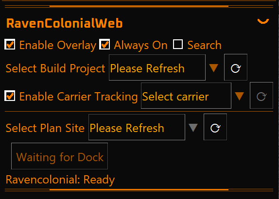
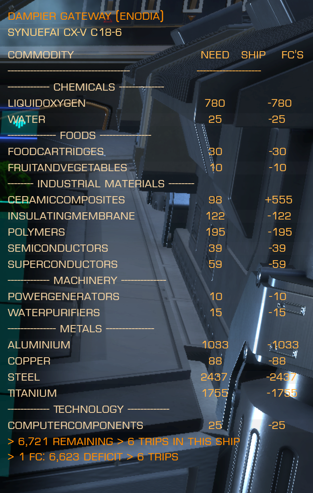

# Ravencolonial EDMC Plugin

   

  

  

An [Elite Dangerous Market Connector (EDMC)](https://github.com/EDCD/EDMarketConnector) plugin that tracks colonization activity and Fleet Carrier stock, and syncs with **[Ravencolonial](https://ravencolonial.com)**—similar goals to **[SrvSurvey](https://github.com/njthomson/SrvSurvey)** while running inside EDMC.

**Source, issues, and releases:** [github.com/Fenris159/ravencolonial_edmc](https://github.com/Fenris159/ravencolonial_edmc)  
**Download the latest build:** [GitHub Releases](https://github.com/Fenris159/ravencolonial_edmc/releases)  
**More documentation:** [docs/README.md](docs/README.md) (manual install, auto-update, release checklist, API reference, logging notes)

---

## Features

The plugin adds a **Ravencolonial** tab to EDMC while you play. You keep EDMC running as usual; it watches your game and can push updates to [ravencolonial.com](https://ravencolonial.com) when you want that extra sync.

| What you get                   | In practice                                                                                                                                                                                                                                                                                                                                                                                                                                                                                                                                                                                                                                                                                                                                                           |
| ------------------------------ | --------------------------------------------------------------------------------------------------------------------------------------------------------------------------------------------------------------------------------------------------------------------------------------------------------------------------------------------------------------------------------------------------------------------------------------------------------------------------------------------------------------------------------------------------------------------------------------------------------------------------------------------------------------------------------------------------------------------------------------------------------------------- |
| **Colonization builds**        | When you’re involved with a colonization **construction megaship** and deliveries, the site can stay in sync with what the game says you still need and what you’ve dropped off—so your squad sees the same picture you do in-game.                                                                                                                                                                                                                                                                                                                                                                                                                                                                                                                                   |
| **Start a new build (Create)** | Docked at the right ship, you can open a form in EDMC to register a new colonization project on Ravencolonial (name, build type, architect, notes, optional Discord link, and similar fields the site expects).                                                                                                                                                                                                                                                                                                                                                                                                                                                                                                                                                       |
| **Plan sites (refresh)**       | Tap refresh to pull the latest planning list from Ravencolonial. **System architects** see **every** site still in **plan**—orbitals, surface ports, stations, and the rest—plus **Create New**. **Anyone else** only sees **orbital** plan sites in the list (a narrowed picker for helpers; see **Link build at dock**).                                                                                                                                                                                                                                                                                                                                                                                                                                            |
| **Link build at dock**         | **Link Build Site** ties the plan site you selected to **where you are docked now** on the server, including depot commodities on first link and the planner’s **body** when the site row has one. **If you are the system architect**, your selection includes the **full** plans list (orbitals, surface ports, stations, etc.). **If you are not the architect**, you only get **orbital** plan rows (**No Orbitals** when that list is empty). Linked sites drop out of the dropdown immediately after a successful link. |
| **Finished-site Market Info**  | Ravencolonial ties colonization sites to in-game **Market Info** via each location’s **MarketID**. When construction finishes, **dock once at the finished outpost** (the completed station—not the construction depot) so the plugin can link your journal MarketID to that system site row. Works for **new** completions and **older** completed builds that never got Market Info backfilled. Needs your **Ravencolonial API key**; after completion the status line asks you to re-dock at the finished location. |
| **Build tracker overlay**      | Optional in-game HUD for a selected **build** project via **EDMCModernOverlay**. The main tab adds overlay controls for **Enable Overlay**, **Always On**, build-project selection, optional system search, and **Enable Carrier Tracking**. The HUD groups remaining commodities by Elite market category, shows **Need**, current **Ship** cargo, optional **FC's** surplus/deficit, assignment hints, row bands, column dividers, localized commodity names where available, and a trip footer based on your current cargo capacity. |
| **Fleet carriers**             | If you link your carriers on Ravencolonial, trades and transfers can update the cargo the site shows for those hulls—your personal carrier and **squadron** carriers you use in a similar way to other tools. You need your **Ravencolonial API key** in the plugin settings for this.                                                                                                                                                                                                                                                                                                                                                                                                                                                                                |
| **Your ship’s cargo**          | Optional: keep the site informed about which ship you’re in, how much cargo space you have, and what’s in the hold (handy next to colonization tools). Needs the **API key**.                                                                                                                                                                                                                                                                                                                                                                                                                                                                                                                                                                                         |
| **Privacy (stealth)**          | Three separate toggles: stop sending **fleet carrier** cargo updates, stop sending **ship hold** snapshots, or stop sending **construction depot / delivery** reporting—mix and match what you’re comfortable sharing.                                                                                                                                                                                                                                                                                                                                                                                                                                                                                                                                                |
| **Updates**                    | Optional check on startup for a newer plugin build on GitHub, a banner when one exists, and one-click style install (restart EDMC afterward). Details: [docs/AUTO_UPDATE_FEATURE.md](docs/AUTO_UPDATE_FEATURE.md).                                                                                                                                                                                                                                                                                                                                                                                                                                                                                                                                                    |
| **Languages**                  | Buttons, messages, and the overlay HUD follow EDMC’s language when possible (French, German, Russian, etc.). Closing EDMC Settings with **OK** refreshes plugin-owned labels after a language change; some overlay commodities use official EDDI game-string resources where available, with English fallback for unsupported locales.                                                                                                                                                                                                                                                                                                                                                                       |

### Screenshots

#### EDMC Plugin Controls

#### In-Game Build Tracker Overlay

---

## Technical

For developers, contributors, and anyone who wants journal event names and API-shaped detail.

### EDMC integration

- The plugin uses EDMC’s **`journal_entry`** stream (same ordering and **`state`** as the core app). It does not read the journal file on its own for normal operation.
- Optional **Frontier CAPI** (Companion) snapshots are used where EDMC exposes them, mainly for **fleet carrier** cargo alignment.

### Colonization (construction sites)

- **Journal:** `ColonisationConstructionDepot` drives remaining need via **`PATCH /api/project/{buildId}`** (full depot snapshot). `ColonisationContribution` records commander delivery history via **`POST …/contribute/{cmdr}`** (does not change need). The plugin does **not** use **`POST …/supply/{cmdr}`**.
- **Dock / project state:** `GET /api/system/{id64}/{marketId}` and related client normalization (see `api/client.py`, [docs/ACTION_MAP_API_FLOWS.md](docs/ACTION_MAP_API_FLOWS.md)).
- **Legacy completed site repair:** on **`Docked`** / docked **`Location`** only (not construction-depot journal lines), when a Ravencolonial API key is set, the plugin can backfill missing or **incorrect** `marketId` on **`complete`** or statusless `/api/v2/system/{SystemAddress}/sites` rows (e.g. depot `396…` left on a row after the finished outpost uses `43…`). Matching is **normalized station name only** (not `BodyID`/`bodyNum`—finished station names and MarketID prefixes differ from depot docks, and multiple sites can share a body). Repair runs when exactly one `/sites` row matches and its stored `marketId` is missing or differs from the dock journal; duplicate names skip the update. If that path does not apply, the same fetched rows are checked for exactly one row whose `marketId` already matches the journal, and that row can be patched with the normalized journal station `name`; duplicate `marketId` rows skip the rename. Eligible journal MarketIDs use colonization prefixes `395`/`396`/`397`/`42`/`43`; fleet carriers, megaships, construction depots, and colonisation ships are excluded. One successful `/sites` GET is matched once; the GET is retried up to three times **only on request failure** (timeout/latency), then the row is patched with only the field being repaired; the last 50 dock `(MarketID, normalized station name)` contexts are remembered to limit repeat lookups while still allowing later name changes to be repaired.

### Create project & plan-site refresh

- **Create (dialog):** `PUT /api/project` with fields aligned to the Ravencolonial OpenAPI (build type, architect, optional pre-planned site, etc.).
- **Plan-site row (↻):** `GET /api/v2/system/{id64}/architect` then `GET /api/v2/system/{id64}/sites`. **Architect match** → all `plan` rows + **Create New** (`plan_sites_allow_create_new`): orbitals, surface ports, stations, etc. **Non-architect** → `plan` rows whose `buildType` passes **`orbital_allowlist.is_orbital_build_type`** only; no **Create New**; empty → **No Orbitals** (helper path at orbital construction docks).
- **Link Build Site:** same `PUT /api/project` link for everyone after selection (includes depot snapshot, `commodities`, `maxNeed`, normalized dock `buildName`, and plan-site **`bodyNum`** / **`bodyName`** when available); the architect simply had the **full** plan list to choose from, the non-architect had an **orbital-filtered** list. Live `GET .../sites` preflight (row must still be `plan`), fresh `GET /api/system/...`, then `PUT` with `architectName` from the EDMC commander string. See [docs/ACTION_MAP_API_FLOWS.md](docs/ACTION_MAP_API_FLOWS.md) for the full guard sequence.

### Fleet carriers

- **Auth:** Ravencolonial API key in settings (same **`rcc-key`** style usage as SrvSurvey for authenticated writes).
- **Journal:** `MarketSell`, `MarketBuy`, `CargoTransfer`, squadron cargo resync paths; squadron carriers inferred from journal signals such as `StationServices` / `squadronBank`.
- **Endpoints:** e.g. `PATCH /api/fc/{marketId}/cargo`, `GET /api/cmdr/{cmdr}/fc/all` for linked carriers and baselines—see the action map.

### Commander ship snapshot

- **Journal / state:** `Cargo`, `Loadout`, `SetUserShipName` (via EDMC `state`) drive optional `POST /api/cmdr/currentShip`-style payloads when enabled.

### Further reading

- **[docs/ACTION_MAP_API_FLOWS.md](docs/ACTION_MAP_API_FLOWS.md)** — journal events ↔ RavenColonial routes.
- **[docs/README.md](docs/README.md)** — install variants, logging, API reference, release notes.
- **[docs/OVERLAY.md](docs/OVERLAY.md)** — build tracker overlay setup and behavior.

---

## Requirements

- **EDMC** 6.1.2 or newer ([releases](https://github.com/EDCD/EDMarketConnector/releases)).
- **Python** bundled with EDMC (currently **3.13.x**). For local dev/CI this repo targets **`requires-python >=3.13.9,<3.14`** in [`pyproject.toml`](pyproject.toml); see also [`.python-version`](.python-version).
- **Ravencolonial account** if you use an API key, create projects, or sync FC / ship data.
- **EDMCModernOverlay** (optional) if you use the in-game build commodity HUD — install separately from [SweetJonnySauce/EDMCModernOverlay](https://github.com/SweetJonnySauce/EDMCModernOverlay). On some Linux distributions the overlay stack can require extra troubleshooting around compositor/window mode dependencies; use borderless/windowed Elite and see [docs/OVERLAY.md](docs/OVERLAY.md).

---

## Installation

1. Download **`RavenColonial_EDMC-v*.zip`** from the **[latest GitHub release](https://github.com/Fenris159/ravencolonial_edmc/releases)** (use the plugin asset, not a source archive, unless the release notes say otherwise).
2. Extract so you have a single folder named **`RavenColonial_EDMC`** containing `load.py` and the rest of the plugin.
3. Copy that folder into your EDMC **plugins** directory:

   - **Windows:** `%LOCALAPPDATA%\EDMarketConnector\plugins\`
   - **Linux:** `~/.local/share/EDMarketConnector/plugins/`
   - **macOS:** `~/Library/Application Support/EDMarketConnector/plugins/`

4. Restart EDMC. Enable the plugin under **File → Settings → Plugins** if needed.

**If in-app auto-update fails** (network, permissions, or GitHub), use **[docs/MANUAL_UPDATE_INSTRUCTIONS.md](docs/MANUAL_UPDATE_INSTRUCTIONS.md)** for a clean manual replace of the plugin folder.

Maintainers can build the same zip with **`make_release.py`** from anywhere (it writes **`build/release/RavenColonial_EDMC-v{version}.zip`** next to the repo; the zip contains a top-level **`RavenColonial_EDMC/`** folder), or use **GitHub Actions → Build release**: leave **Publish GitHub release** off to download only the artifact, or turn it on to create tag **`v*`** and a Release from **`load.py`** `plugin_version`; alternatively push tag **`v*`** that matches **`load.py`** to publish the same way.

To drop local **`__pycache__`**, **`dist/`**, egg-info metadata, and setuptools outputs under **`build/`** (such as **`build/lib/`**) without touching release artifacts, run **`python scripts/clean_build_artifacts.py`**. That script **always keeps `build/release/`** (including shipped zips). Optional **`--include-stray-root-zips`** only removes legacy **`RavenColonial_EDMC-v*.zip`** files sitting in the **repo root**, not under **`build/release/`**.

---

## Configuration (File → Settings → Ravencolonial tab)

### API key (`ravencolonial_api_key`)

- Get it from **Ravencolonial → account / user settings** (same key SrvSurvey uses as `rcc-key` for authenticated writes).
- **Required** for: Fleet Carrier cargo updates (personal or linked **squadron** carriers), commander **current ship** hold sync, and any server-side features that expect your account context.
- **Project creation** and many read/update flows still need the game + journal context; some calls work without a key depending on server policy—set the key for the full experience.

### Optional API base URL (`ravencolonial_api_url`)

- Advanced: override the default Ravencolonial API host (see `PluginConfig.DEFAULT_API_BASE` in `[plugin_config/settings.py](plugin_config/settings.py)`).

### Privacy — three stealth toggles

| Setting                                          | Config key                                     | When enabled                                                                                                                                                                                                                            |
| ------------------------------------------------ | ---------------------------------------------- | --------------------------------------------------------------------------------------------------------------------------------------------------------------------------------------------------------------------------------------- |
| **Stealth: Fleet Carrier data**                  | `ravencolonial_stealth_mode`                   | No FC commodity journal handlers and no CAPI FC cargo uploads to Ravencolonial.                                                                                                                                                         |
| **Stealth: commander ship cargo**                | `ravencolonial_stealth_ship_cargo`             | No **`POST /api/cmdr/currentShip`** (hold / loadout snapshot).                                                                                                                                                                          |
| **Stealth: all construction delivery reporting** | `ravencolonial_stealth_construction_reporting` | No processing of **`ColonisationConstructionDepot`**, **`ColonisationContribution`**, or **`CargoDepot`** for Ravencolonial API updates from the journal. *(Create Project from the dialog is unchanged—it is a deliberate UI action.)* |

Click **Save Settings** (or OK on the main Settings dialog—prefs are persisted on dismiss).

### Update settings

- **Check for updates on startup** — queries [GitHub Releases](https://github.com/Fenris159/ravencolonial_edmc/releases) for a newer tag.
- **Automatically install updates** — downloads and swaps the plugin folder (EDMC restart required).
- **Include pre-release versions** — treat beta/rc tags as candidates when comparing versions.

Details: [docs/AUTO_UPDATE_FEATURE.md](docs/AUTO_UPDATE_FEATURE.md).

---

## Usage

1. Run **EDMC** while playing (or before launching the game).
2. **Dock** at colonization construction sites and deliver cargo as usual; watch the plugin status line for confirmations.
3. Open **[ravencolonial.com](https://ravencolonial.com)** for project progress and FC/ship data the server exposes.

### Create Project

When docked at a **construction site**, use **Create Build Project** (or open project link when a build already exists—labels depend on state):

1. Choose **build type** (full tiered list in the dialog).
2. **Project name**, **architect**, optional **pre-planned site**, **body**, **notes**, **Discord** link as needed.
3. **Create** submits **`PUT /api/project`** with journal-backed depot data when available. On success the main tab switches to **Open Build Page** when the server reports the new project at your dock.

### Plan sites and Link Build Site

When docked at a **colonization construction** location (construction megaship, and other eligible construction docks), the plugin shows **Select Plan Site** above the main button row when the flow applies.

#### Who sees what after **Refresh** (↻)

Refresh always loads **`GET /api/v2/system/{id64}/architect`** (who Ravencolonial lists as this system’s architect) and **`GET /api/v2/system/{id64}/sites`**, then compares the architect name to **your** commander in EDMC (case-insensitive).

- **You are the system architect** (names match): the dropdown lists **all** sites in **plan** status—**orbital and surface types** (ports, stations, megaships, and anything else the API returns as planning rows)—plus **Create New** for a scratch **Create Build Project** from the main tab. When you use **Link Build Site**, you are binding whichever **plan** row you picked to **this** dock, so it can match whatever construction site you are actually docked at, not only megaships.
- **You are not the system architect**: the dropdown lists only **plan** sites whose **buildType** is an **orbital** (same allowlist as the RavenColonial web client’s orbital set—see **`orbital_allowlist.py`** in this plugin). **Create New** is **not** shown on this path—that remains for the architect on the website or in the scratch dialog. That narrower list is so a **helper** docked at an **orbital** construction ship can still **Link** an orbital the architect pre-planned on Ravencolonial—including when the architect has **moved the site forward remotely** and wants someone in-game to finish the **link-at-dock** step—without being offered incompatible **surface** plan rows for that dock. **Surface**-only plan rows are omitted from this picker, not from the architect’s picker.
- If you are not the architect and **no** orbital **plan** rows exist, the row shows **No Orbitals** (disabled), not a false “nothing to do” architect error.

If refresh fails (network, HTTP error, or no commander context yet), a **themed popup** explains what went wrong; use **Copy Error Msg** for bug reports. The combobox keeps a **short** status label so the window layout stays stable.

#### Steps

1. Tap **Refresh** (↻) when you need an up-to-date list for the current system.
2. Pick a site from the dropdown (or **Create New**, when you are the architect and it is shown).
3. **Link Build Site** sends **`PUT /api/project`** so Ravencolonial connects the selected **`systemSiteId`** to **this** dock (`marketId` / `systemAddress`), with **`architectName`** set from **your** commander string in EDMC—normal **LoadGame** / journal flow must have loaded your name. The **same** button is used whether you are the architect (any plan row you could pick) or a helper (orbital plan rows only).

#### Safety checks before Create / Link

These steps reduce accidental **duplicate** projects when the website and game state don’t quite line up:

- The plugin asks Ravencolonial whether a build **already exists** for this dock. It only trusts a clear “yes, here’s the project” answer (including common **`buildId`** spellings and wrapped JSON shapes). Vague “nothing active” messages are treated as **no** active link—not as proof the slot is free to reuse if something is still registered on the server.
- **Immediately before** opening **Create Build Project** or starting **Link Build Site**, it **re-checks** that dock slot on the network so a build that appeared while you were still docked is detected and the flow switches to **Open Build Page** instead.
- Right before sending the link, it **looks up your plan site again** on Ravencolonial. If that site is no longer in the planning stage (construction has started or finished), linking stops and you’ll see a message instead of creating a second project.

Technical details (which journal events call which URLs): **[docs/ACTION_MAP_API_FLOWS.md](docs/ACTION_MAP_API_FLOWS.md)**.

### Build tracker overlay

The optional overlay row appears on the main tab when **EDMCModernOverlay** is installed and enabled. It is designed for commanders hauling build commodities who want the current project needs visible in Elite without alt-tabbing.

Main-tab controls:

- **Enable Overlay** turns the HUD on for a selected project.
- **Always On** keeps the HUD visible while undocked; otherwise it is intended for docked build work.
- **Search** lets you type a system name and refresh build projects outside your current journal system context.
- **Select Build Project** lists Ravencolonial rows in `build` status for the current or searched system.
- **Enable Carrier Tracking** adds an **FC's** column and footer line for **All** linked carriers or one selected carrier callsign.
- The overlay refresh (↻) loads build projects only; the plan-location refresh also updates this list when it has build rows.

HUD contents:

- Build name, build type, and system/station context.
- Remaining commodities grouped under Elite market categories such as **Chemicals**, **Foods**, **Industrial Materials**, **Machinery**, and **Metals**.
- **Need** shows remaining project demand; **Ship** shows your current hold; **FC's** shows carrier surplus/deficit when carrier tracking is enabled.
- Assignment hints appear when the Ravencolonial project has commander assignments (`📌` for yours, `x` for another commander).
- Fulfilled commodities are hidden, zero ship cargo is blank, and subtle row bands/column dividers improve readability.
- Footer shows total remaining units and estimated **trips in this ship** from EDMC’s current `CargoCapacity`; with carrier tracking it also shows the selected carrier deficit and trips.
- Overlay text and commodity names follow EDMC’s language where plugin translations exist. For several Latin/Cyrillic locales, commodity/category names use EDDI’s extracted Elite Dangerous game strings; unsupported locales fall back to English.

Overlay themes, including **Elite Orange** and **Cerulean Gold**, are configured under **File → Settings → Ravencolonial**. For deeper setup and troubleshooting, see **[docs/OVERLAY.md](docs/OVERLAY.md)**.

Linux note: EDMCModernOverlay may need distro-specific troubleshooting depending on compositor, desktop environment, graphics stack, and Elite window mode. Start with Elite in **borderless** or **windowed** mode, confirm EDMCModernOverlay itself is drawing, then use [docs/OVERLAY.md](docs/OVERLAY.md) for plugin-specific setup.

### Fleet Carriers

Link each carrier you care about (personal or **squadron** fleet carrier) on Ravencolonial under your commander profile so the server returns it in `/fc/all`. With an **API key** set, the plugin mirrors FC trades/transfers and optional CAPI cargo refresh; journal logic treats squadron carriers like SrvSurvey so transfers and resync behave correctly when `StationServices` includes **squadronBank**.

### Commander ship snapshot

With an **API key**, cargo and capacity updates (after **`Loadout`** provides capacity) are sent so Ravencolonial can show your current ship loadout context alongside colonization tools.

---

## Troubleshooting

- **RavenColonial-only log (bug reports):** the plugin writes a dedicated rotating log next to its install: **`plugins/<RavenColonial_EDMC folder>/logs/RavenColonial_EDMC.log`** (for example on Windows `%LOCALAPPDATA%\EDMarketConnector\plugins\RavenColonial_EDMC\logs\RavenColonial_EDMC.log`). It includes main plugin messages plus **API** and **fleet carrier** module lines (not mixed into EDMC’s global log). Attach the latest file when opening a GitHub issue (redact your API key if you pasted it into chat).
- **Plugin errors:** EDMC main log — on Windows typically `%TEMP%\EDMarketConnector\EDMarketConnector.log`; on Linux/macOS typically under `~/.local/share/EDMarketConnector/` or `~/Library/Application Support/EDMarketConnector/` (see EDMC docs if your install differs).
- **API / auth:** confirm API key and that stealth toggles match what you intend to upload.
- **Overlay on Linux:** if EDMCModernOverlay works on Windows but not on your Linux distro, first verify Elite is borderless/windowed and EDMCModernOverlay can render any test overlay. Some compositor/window manager combinations need distro-specific overlay troubleshooting before this plugin's HUD can appear.
- **Manual install:** [docs/MANUAL_UPDATE_INSTRUCTIONS.md](docs/MANUAL_UPDATE_INSTRUCTIONS.md).

---

## Credits

- **SrvSurvey** — reference colonization client by [grinning2001 / njthomson](https://github.com/njthomson/SrvSurvey).
- **Ravencolonial** — platform by [grinning2001](https://ravencolonial.com).
- **EDMC** — [EDCD](https://github.com/EDCD/EDMarketConnector).
- **This plugin** — maintained by **[Fenris159](https://github.com/Fenris159)**; builds on earlier community work (CMDR Dirk Pitt13 / toemaus313 and related forks).

---

## License

This project is licensed under the **[MIT License](LICENSE)**.

**EDMC** itself is distributed under **its own** terms (see the [EDMarketConnector](https://github.com/EDCD/EDMarketConnector) repository). This plugin’s MIT license applies to **this repository’s** code only.

---

## Support

- **Issues:** [github.com/Fenris159/ravencolonial_edmc/issues](https://github.com/Fenris159/ravencolonial_edmc/issues)
- **EDMC plugins:** [EDMC Wiki — Plugins](https://github.com/EDCD/EDMarketConnector/wiki/Plugins)
- **Ravencolonial:** [ravencolonial.com](https://ravencolonial.com)

---

## Version history

See **[CHANGELOG.md](CHANGELOG.md)** for the full record.

| Version   | Summary |
| --------- | ------- |
| **1.7.3** | Completed-site repair now writes through targeted `PATCH /api/v2/system/{nameOrNum}/sites/{siteId}` with journal `SystemAddress` ID64 routing; name-matched MarketID repairs patch only `marketId`, and unique marketId-matched rows can patch only `name`. |
| **1.7.2** | Hotfix: fixes v1.7.1 legacy MarketID repair (name-only matching, eligibility gates, retry worker); construction-complete status asks commanders to re-dock at the finished location; locale strings updated. |
| **1.6.5** | Plan-site themed error dialog and short combobox labels; click-time location re-fetch before Create/Link; project-location cache throttling; `resolve_build_id` and wrapped `GET /api/system/...` parsing; main tab refresh after successful Create Project; docked button resolve/apply split; no client `/sites` merge for dock lookup; action-map docs aligned (see changelog). |
| **1.6.4** | Auto-update on Windows: release CAPI cache and issue log before folder replace (`WinError 32`); update banner `v` display; shorter error dialog text; status line wrap; Select Plan Site themed combobox (see changelog). |
| **1.6.3** | Link Build Site: `architectName` on `PUT`, `/sites` preflight, `404` completion hints; normalized `/api/system/...`; short-lived project GET cache; depot supply dedup; undock status shows station name; docs (see changelog). |
| **1.6.2** | CAPI snapshot cache (`capi_cache/`) for analysis; squadron fleet carrier journal tracking (SrvSurvey-style), MIT license, README refresh (see changelog). |
| **1.6.1** | Commander ship `currentShip` sync; three-way stealth (FC / ship cargo / construction reporting); UI in many languages (follows EDMC’s language); docs refresh. |
| **1.6.0** | Maintainer/repo handoff to **Fenris159/ravencolonial_edmc**, packaging and HTTP alignment, auto-update UX. |

Older releases remain listed in the changelog.
